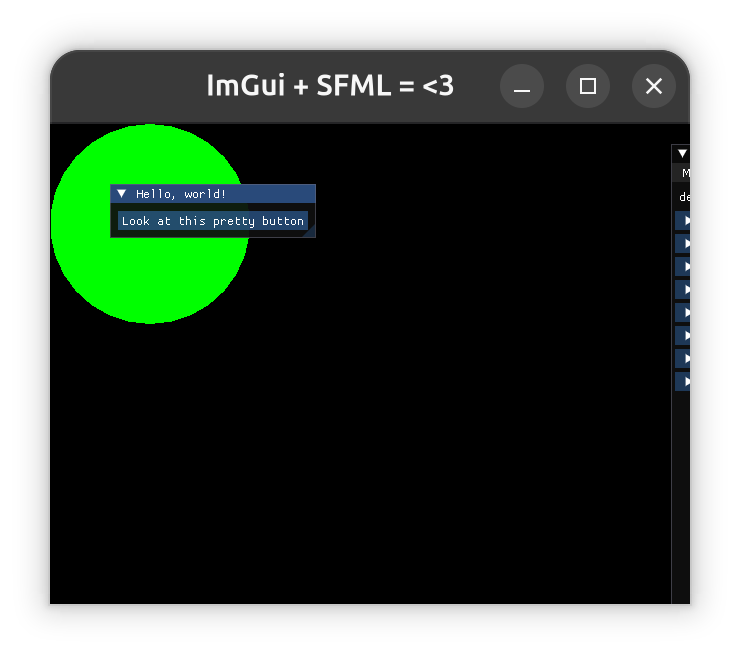

# SFML-IMGUI Project setup

This git repo will help you set you your sfml-imgui environment with a few commands. Treat this as a templete for project that may require this, because setting it up could be cumbersome.
This set up makes use of:
* sfml = 3.0.0
* ImGui = 1.91.1-docked
* sfml-imgui = v3.0

# Setup
The setup requires you to have [cmake](https://cmake.org/) installed. The below is the setup for your project:
```
git clone --depth 1 https://github.com/nikhileshjo/sfml-imgui.git my-new-project
cd my-new-project

# remove git
rm -rf .git
```

Now, test if everything works:
```
mkdir build
cd build
cmake ../
cmake --build .
```
if everything goes smoothly, your build will complete successfully. Once that's done, run the executable from root folder: `./build/src/example_exe`
You should see a window pop-up on your screen like below:


If you something similar, your project environment is ready to work on.
